# dchart - charts for deck

```dchart``` generates deck markup for bar, line, scatter, dot, volume, donut and proportional charts, reading data from the standard input or specified files. 
Unless specified otherwise, each input source generates a slide in the deck.

The input data format a tab-separated or CSV formatted list of ```label,data``` pairs where label is an arbitrary string, 
and data is intepreted as a floating point value. 

A line beginning with "#" is parsed as a title, 
with the title text beginning after the "#".  If a third column is present, it serves as an annotation.
label strings with ```\n``` characters denote multi-line labels.


Here is an example input data file:

	# GOOG Stock Volume (Millions of Shares)
	2017-01-01	33.1916
	2017-02-01	25.6825
	2017-03-01	33.8351	Peak
	2017-04-01	25.1619
	2017-05-01	32.1801

Example CSV file:
	
	#,GOOG Stock Volume (Millions of Shares)
	2017-01-01,33.1916
	2017-02-01,25.6825
	2017-03-01,33.8351,Peak
	2017-04-01,25.1619
	2017-05-01,32.1801

Typically ```dchart``` generates input for deck clients like ```pdfdeck```, or ```pdi``` (a shell script for pdfdeck which reads
deck markup on the standard input and produces PDF on the standard output).

	$ dchart foo.d bar.d baz.d > fbb.xml && pdfdeck fbb.xml && open fbb.pdf
	$ dchart -min=0 -max=700 -datafmt %0.2f -line -bar=f -vol -dot [A-Z]*.d | pdi > allvol.pdf
	$ ls -lS | awk 'BEGIN {print "# File Size"} NR > 1 {print $NF "\t" $5}' | dchart -hbar | pdi > fs.pdf

## Defaults

With no options, ```dchart``` makes a bar graph, showing data values and every data label.

## Placement

The plot is positioned and scaled on the deck canvas with the 
```-top```, ```-bottom```, ```-left```, and ```-right``` flags. 
These flag values represent percentages on the deck canvas.

## Chart types and elements

The ```-bar```, ```-hbar```, ```-line```, ```-dot```, ```-scatter```, ```-vol```, 
```-pgrid```, ```-pmap```,```-donut```, and ```-radial```.
flags specify the chart types.

The ```-grid```, ```-title```, ```-val```, and ```-yaxis``` 
flags control the visibility of plot components. 


## Command line options

	-dmim        data minimum (default false, min=0)
	-min         set the minimum value
	-max         set the maximum value
	-csv         read CSV files (default false)
	-csvcol      specify the columns to use for label,value

	-bar         show bar chart (default true)
	-wbar        show "word" bar chart (default false)
	-hbar        horizontal chart layout (default false)
	-scatter     show a scatter chart (default false)
	-dot         show dot plot (default false)
	-lego        show lego chart (default false)
	-bowtie      show bowtie chart (default false)
	-fan         show fan chart (default false)
	-line        show line chart (default false)
	-slope       show a slope chart (default false)
	-frame       show a frame outlining the chart (default false)
	-datacond    conditional coloring (low,high,color)
	-rline       show regression line (default false)
	-vol         show volume plot (default false)
	-pgrid       show a proportional grid (default false)
	-pmap        show proportional map (default false)
	-donut       show a donut chart (default false)
	-radial      show a radial chart (default false)
	-spokes      show a radial chart with spokes (default false)

	-grid        show gridlines on the y axis (default false)
	-val         show values (default true)
	-pct         show percentages with values (default false)
	-valpos      value position (t=top, b=bottom, m=middle) (default "t")
	-yaxis       show a y axis (default true)
	-yrange      specify the y axis labels (min,max,step)
	-fulldeck    generate full deck markup (default true)
	-title       show title (default true)
	-chartitle   specify the title (overiding title in the data)
	-hline       horizontal line with optional label (value,label)
	-noteloc     note location (c-center, r-right, l-left, default c)
	
	-top         top of the plot (default 80)
	-bottom      bottom of the plot (default 30)
	-left        left margin (default 20)
	-right       right margin (default 80)
	
	-psize       diameter of the donut (default 30)
	-pwidth      width of the donut or proportional map (default 3 time textsize)
	-solidpmap   use solid colors for pmaps
	-barwidth    barwidth (default computed from the number of data points)
	-linewidth   linewidth for line charts (default 0.2)
	-ls          linespacing (default 2.4)
	-textsize    text size (default 1.5)
	-xlabel      x axis label interval (default 1, 0 to supress all labels)
	-xlabrot     x axis label rotation (default 0, no rotation)
	-xstagger    stagger x axis labels
	-xlast       show the last x label
	-color       data color (default "lightsteelblue")
	-framecolor  frame color (default "rgb(127,0,0)")
	-rlcolor     regression line color (default "rgb(127,0,0)")
	-vcolor      value color (default "rgb(127,0,0)")
	-lcolor      axis label color (default "rgb(75,75,75)")
	-volop       volume opacity (default 50)
	-datafmt     data format for values (default "%.1f")
	-note        show annotations (default true)


## Examples

Using this data in ```AAPL.d```

	# AAPL Volume
	2017-01-01	563.122
	2017-02-01	574.969
	2017-03-01	561.628
	2017-04-01	373.304
	2017-05-01	653.755
	2017-06-01	684.178
	2017-07-01	421.992
	2017-08-01	661.069
	2017-09-01	679.879
	2017-10-01	504.291
	2017-11-01	600.663
	2017-12-01	417.354

here are some variations.

	$ dchart AAPL.d

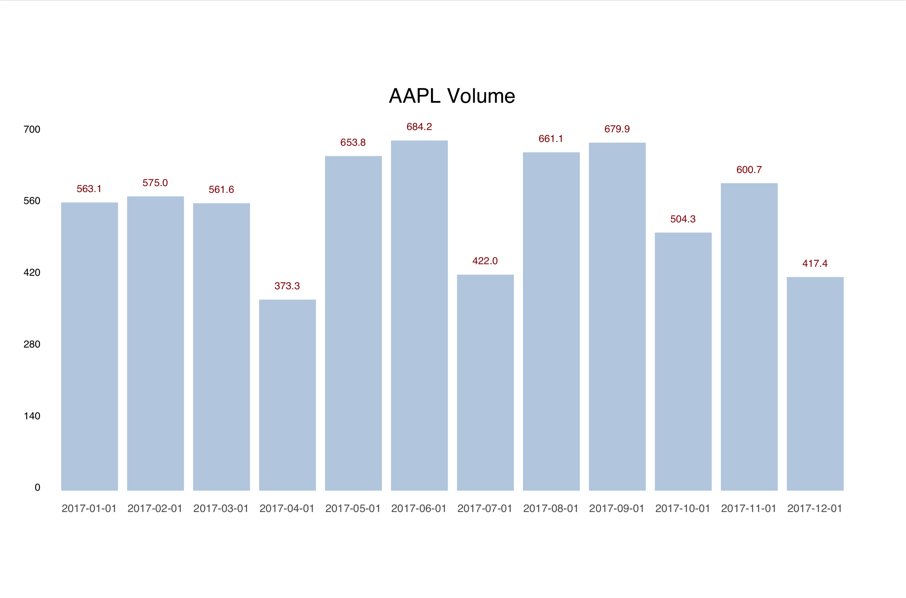

	$ dchart -yrange=0,700,50 AAPL.d

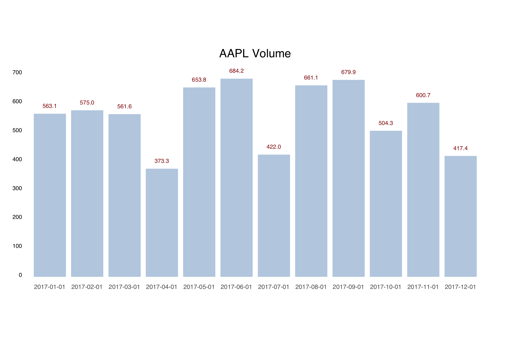

	$ dchart -xlabel=2 -left 30 -right 70 -top 70 -bottom 40 -yaxis=f AAPL.d

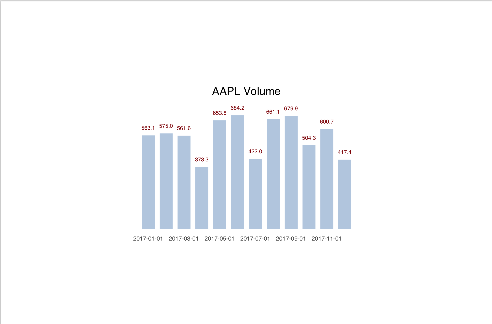

	$ dchart -color gray AAPL.d


	$ dchart -grid AAPL.d # add a y axis grid


	$ dchart -grid -barwidth=1 AAPL.d # adjust the bar width

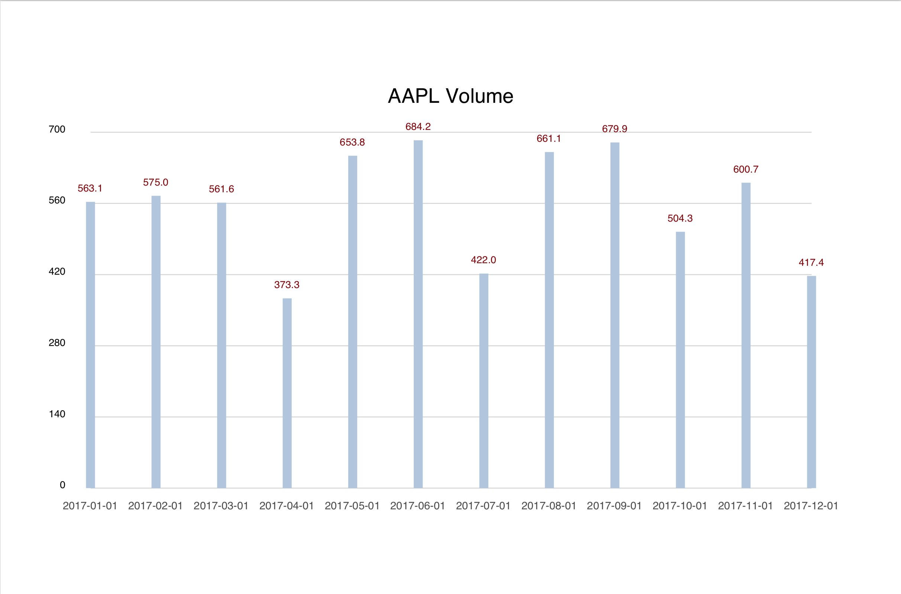

	$ dchart -bar=f -dot AAPL.d # no bars, dot plot

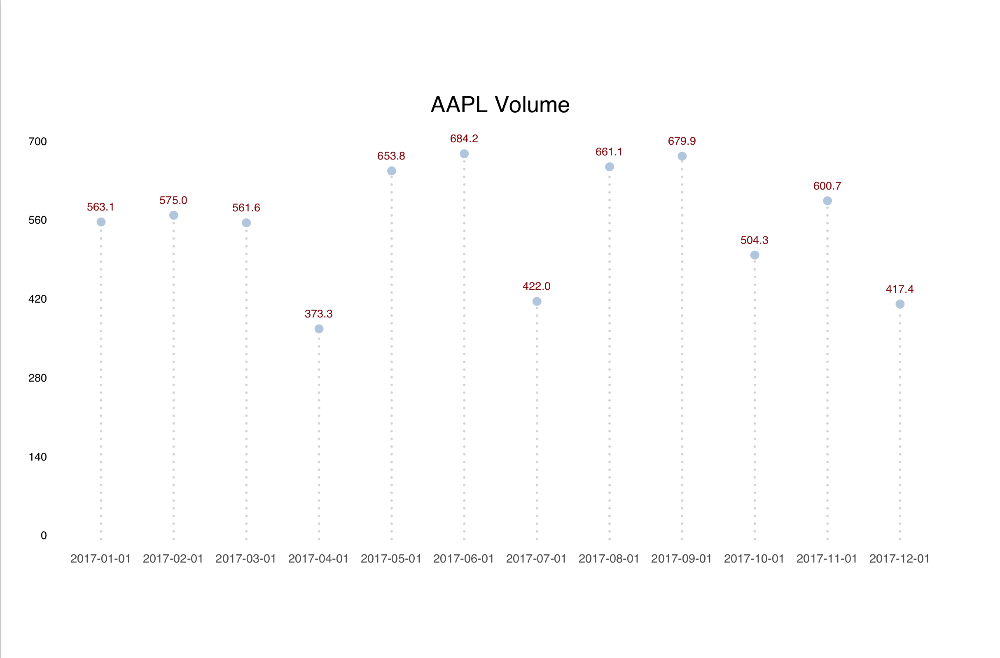

	$ dchart -bar=f -vol AAPL.d # no bars, volume plot

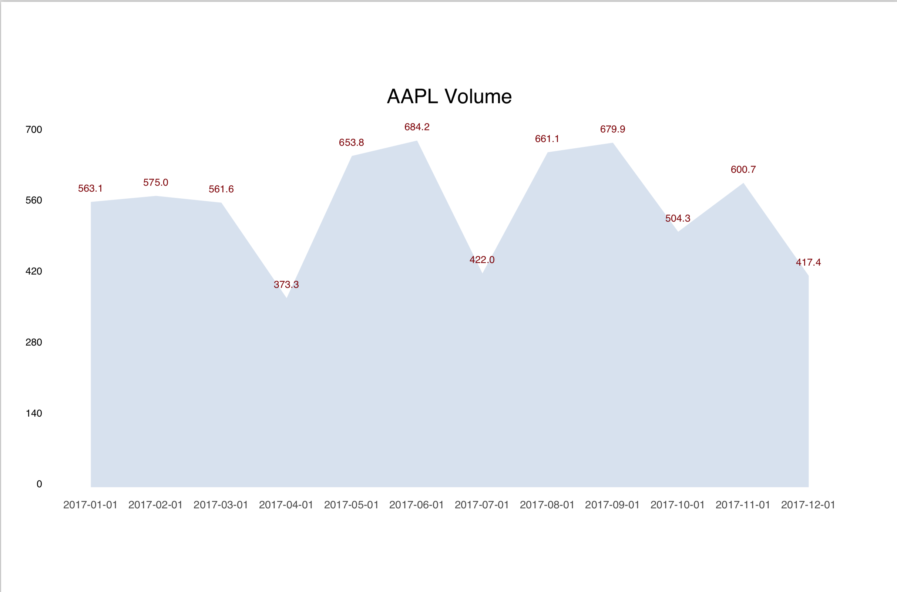

	$ dchart -datafmt %0.2f -bar=f -dot -line AAPL.d


	$ dchart -bar=f -line AAPL.d # line chart

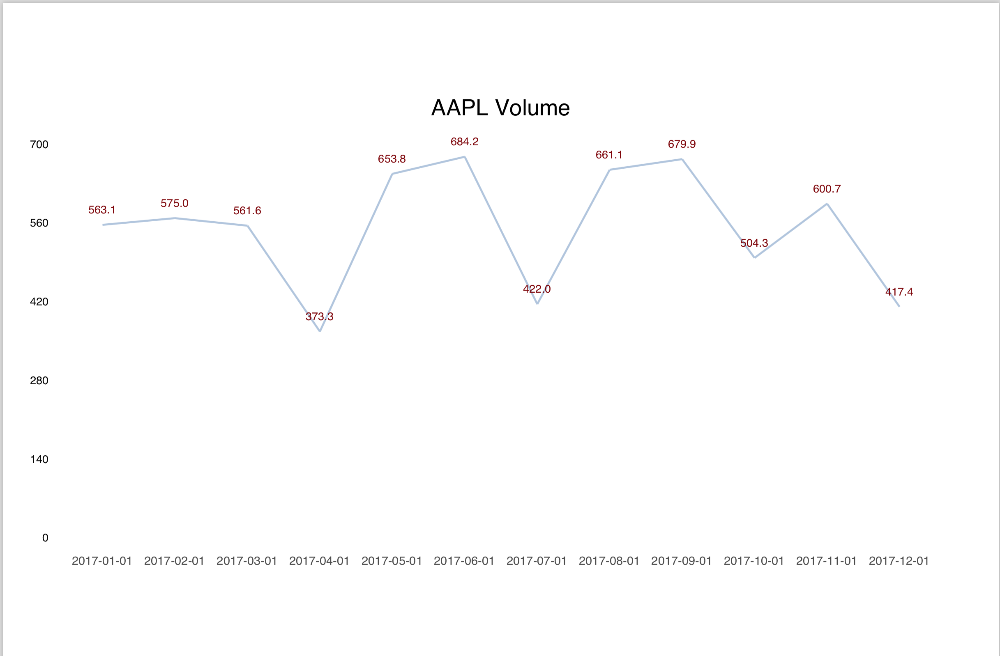

	$ dchart -bar=f -line -yaxis=f -val=f AAPL.d # only show line and x axis

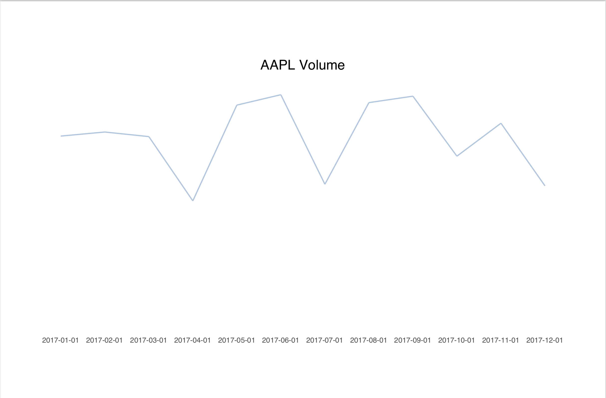


	$ dchart -scatter -val=f -bar=f -yaxis=f AAPL.d

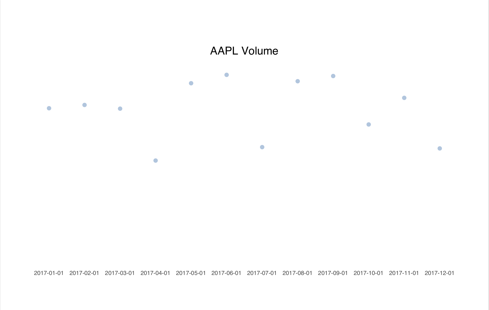


	$ dchart -bar=f -line -vol -dot AAPL.d # combine line, volume, and dot


	$ dchart -bar=f -line -vol -dot -yaxis=f AAPL.d # as above, removing the y-axis

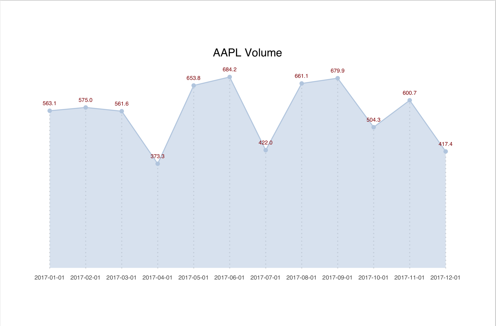

	$ dchart -bar=f -line -vol -dot -grid AAPL.d

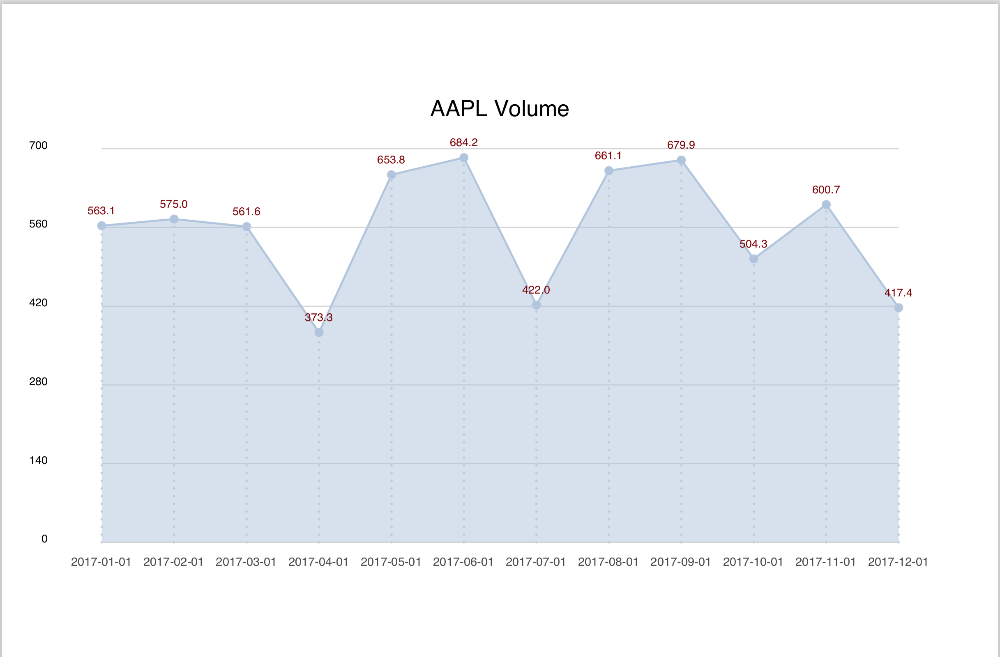

	$ dchart -hbar AAPL.d


	$ sort -k2 -nr pdf.d | dchart -left 20 -hbar


Using this data in ``browser.d``

	# Browser Market Share Dec 2016-Dec 2017
	Chrome	53.72
	Safari	14.47
	Other	9.36
	UC	8.28
	Firefox	6.23
	IE	3.99
	Opera	3.9

here are views of proportional data:
	
	$ dchart -wbar browser.d
	
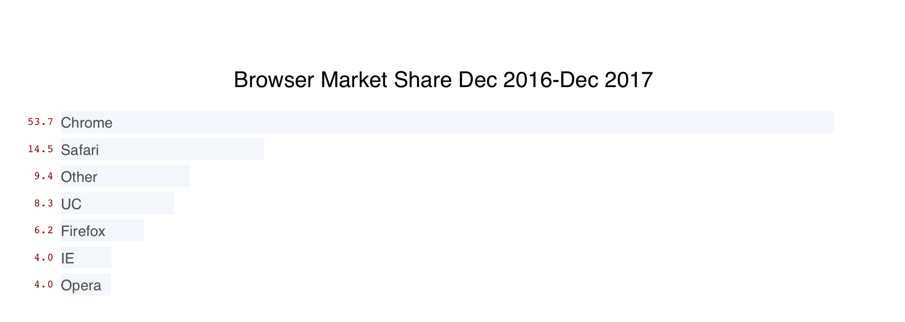
	
	$ dchart -donut -color=std -pwidth=5 browser.d


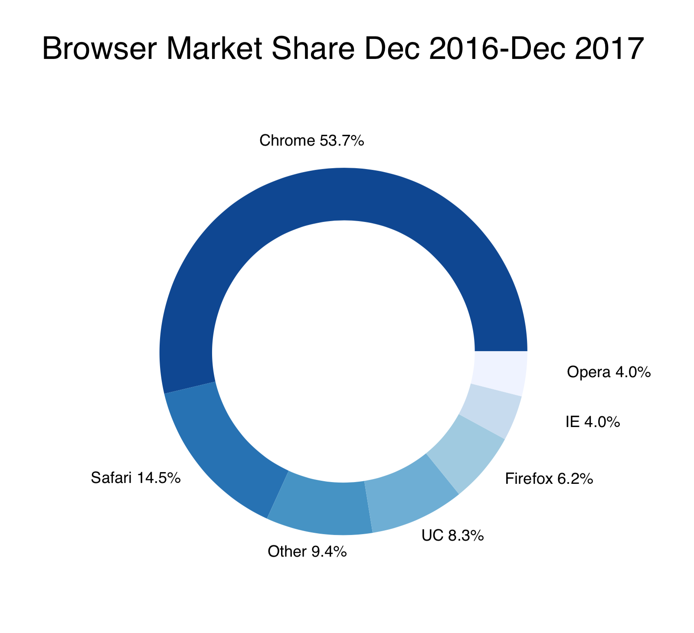

	$ dchart -pmap -pwidth=5 -textsize=1 browser.d


Using this data in incar.d:

	# US Incarceration Rate
	White	39	antiquewhite
	Hispanic	19	burlywood
	Black	40	sienna
	Other	2	gray

the note field may be used to specify the color

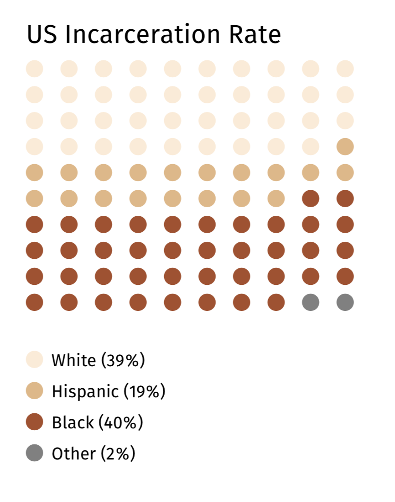

	$ dchart -ls 3 -val=f -pgrid incar.d

Here is the lego chart variation:


	$ dchart -left 30 -top 80 -lego -textsize 4 

Using this data in slope.d

	# Test Slope Graphs
	one     20      First
	two     80

	three   0       Second
	four    0

	five    100     Third
	six     0

	seven   0       Fourth
	eight   100

	nine    50      Fifth
	ten     50

	eleven  100     Sixth
	twelve  100


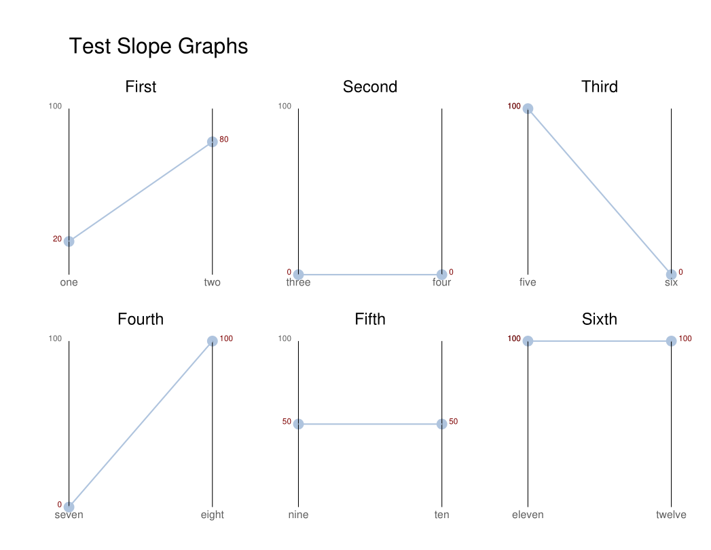

	$ dchart -slope -left=10 -right=30 -top=80 -bottom=60 slope.d
	


Using this data in count.d:

	# Count Of Things
	One	10	red
	Two	20	green
	Three	30	blue
	Four	40	purple
	Five	50	yellow
	Six	60	black
	Seven	70	brown
	Eight	80	silver
	Nine	90	orange
	Ten	100	pink

	$ dchart -psize=10 -pwidth=40 -left=50 -top=50 -radial -textsize=3 data/incr.d|pdf -pagesize 800,800


Using this data:

	# Clockwise
	twelve	12	red
	one	1	green
	two	2	blue
	three	3	purple
	four	4	maroon
	five	5	black
	six	6	brown
	seven	7	silver
	eight	8	orange
	nine	9	pink
	ten	10
	eleven	11

	$ dchart -psize=10 -pwidth=40 -left=50 -top=50 -radial -textsize=3 -spokes data/clock.d|pdf -pagesize 800,800


